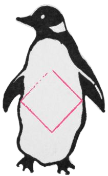

# Darkside - HackMyVM (Easy)



## Übersicht

*   **VM:** Darkside
*   **Plattform:** [HackMyVM](https://hackmyvm.eu/machines/machine.php?vm=Darkside)
*   **Schwierigkeit:** Easy
*   **Autor der VM:** DarkSpirit
*   **Datum des Writeups:** 2023-11-18
*   **Original-Writeup:** https://alientec1908.github.io/Darkside_HackMyVM_Easy/
*   **Autor:** Ben C.

## Kurzbeschreibung

Das Ziel dieser "Easy"-Challenge war es, User- und Root-Zugriff auf der Maschine "Darkside" zu erlangen. Der Angriff begann mit der Enumeration eines Webservers, auf dem ein Backup-Verzeichnis (`/backup/`) mit einer Benutzerliste (`vote.txt`) entdeckt wurde. Ein Passwort für den Benutzer `kevin` für das Web-Login wurde mittels Hydra gefunden. Nach dem Login führte eine Reihe von Rätseln (dekodierte Pfade, Cookie-Manipulation) zum Fund von SSH-Zugangsdaten für `kevin`. Als `kevin` wurde durch eine geleakte History-Datei das Passwort für den Benutzer `rijaba` entdeckt. Nach dem Wechsel zu `rijaba` konnte eine unsichere `sudo`-Regel ausgenutzt werden, die `rijaba` erlaubte, `nano` als Root auszuführen, um so Root-Rechte zu erlangen.

## Disclaimer / Wichtiger Hinweis

Die in diesem Writeup beschriebenen Techniken und Werkzeuge dienen ausschließlich zu Bildungszwecken im Rahmen von legalen Capture-The-Flag (CTF)-Wettbewerben und Penetrationstests auf Systemen, für die eine ausdrückliche Genehmigung vorliegt. Die Anwendung dieser Methoden auf Systeme ohne Erlaubnis ist illegal. Der Autor übernimmt keine Verantwortung für missbräuchliche Verwendung der hier geteilten Informationen. Handeln Sie stets ethisch und verantwortungsbewusst.

## Verwendete Tools

*   `arp-scan`
*   `nmap`
*   `nikto`
*   `gobuster`
*   `dirb`
*   `wfuzz`
*   `awk`
*   `tr`
*   `hydra`
*   `CyberChef`
*   `ssh`
*   `sudo`
*   `find`
*   `nano` (als Exploit-Tool)
*   Standard Linux-Befehle (`ls`, `cat`, `echo`, `mkdir`, `su`, `id`, `vi` oder anderer Editor für `/etc/hosts`)

## Lösungsweg (Zusammenfassung)

Der Angriff auf die Maschine "Darkside" gliederte sich in folgende Phasen:

1.  **Reconnaissance & Enumeration:**
    *   IP-Findung mittels `arp-scan` (Ziel: `192.168.2.104`, Hostname `darkside.hmv`).
    *   `nmap`-Scan identifizierte offene Ports: SSH (22/tcp, OpenSSH 8.4p1) und HTTP (80/tcp, Apache httpd 2.4.56).
    *   Nmap wies auf ein `PHPSESSID`-Cookie ohne `HttpOnly`-Flag hin.

2.  **Web Enumeration:**
    *   `nikto` bestätigte fehlende Sicherheitsheader und fand das Verzeichnis `/backup/` mit aktiviertem Directory Indexing.
    *   `gobuster` und `dirb` bestätigten ebenfalls das `/backup/`-Verzeichnis.
    *   Im Verzeichnis `/backup/` wurde die Datei `vote.txt` gefunden, die eine Liste von Benutzernamen und den Hinweis "good luck kevin" enthielt.
    *   `wfuzz` zur Parametersuche auf `index.php` blieb erfolglos.

3.  **Initial Access (SSH als kevin):**
    *   Mit `hydra` wurde ein Brute-Force-Angriff auf das Web-Login-Formular (`index.php`) für den Benutzer `kevin` durchgeführt. Das Passwort `iloveyou` wurde gefunden.
    *   Nach dem Web-Login als `kevin:iloveyou` wurde eine Seite mit einem Pfadfragment `.onion` und einem Base58/Base64-kodierten String angezeigt.
    *   Der String wurde mit CyberChef (From Base58, dann From Base64) zu `sfqekmgncutjhbypvxda.onion` dekodiert.
    *   Die Seite unter diesem neuen Pfad enthielt JavaScript, das prüfte, ob ein Cookie `side` den Wert `darkside` hat, um zu `hwvhysntovtanj.password` weiterzuleiten.
    *   Nach Setzen des Cookies `side=darkside` wurde die Datei `hwvhysntovtanj.password` heruntergeladen, die die SSH-Zugangsdaten `kevin:ILoveCalisthenics` enthielt.
    *   Ein SSH-Login als `kevin` mit diesen Credentials war erfolgreich. Die User-Flag wurde gelesen.

4.  **Post-Exploitation / Privilege Escalation (von `kevin` zu `rijaba`):**
    *   Als `kevin` wurde die Datei `.history` im Home-Verzeichnis gefunden.
    *   Diese enthielt den Befehl `su rijaba` und das dazugehörige Passwort `ILoveJabita`.
    *   Mit `su rijaba` und dem Passwort `ILoveJabita` wurde erfolgreich zum Benutzer `rijaba` gewechselt.

5.  **Privilege Escalation (von `rijaba` zu root):**
    *   Der Befehl `sudo -l` als `rijaba` zeigte, dass der Benutzer `/usr/bin/nano` als `root` ohne Passwort ausführen darf: `(root) NOPASSWD: /usr/bin/nano`.
    *   Diese unsichere `sudo`-Regel wurde gemäß GTFOBins ausgenutzt:
        1.  `sudo nano` ausführen.
        2.  In `nano` die Tastenkombination `Strg+R` (Read File) und dann `Strg+X` (Execute Command) drücken.
        3.  Den Befehl `reset; sh 1>&0 2>&0` eingeben und Enter drücken.
    *   Dies resultierte in einer interaktiven Root-Shell (`uid=0(root)`).

## Wichtige Schwachstellen und Konzepte

*   **Directory Indexing / Information Disclosure:** Das öffentlich zugängliche `/backup/`-Verzeichnis mit der Datei `vote.txt` legte Benutzernamen offen.
*   **Schwache Web-Login-Passwörter / Brute-Force:** Das Passwort `iloveyou` für den Web-Login von `kevin` wurde via `hydra` gefunden.
*   **Security through Obscurity / Client-Side Controls:** Die Kette aus kodierten Pfaden und Cookie-basierter Weiterleitung bot keine echte Sicherheit und konnte leicht umgangen werden.
*   **Password in History File:** Das Passwort für den Benutzer `rijaba` wurde in der `.history`-Datei von `kevin` gefunden.
*   **Unsichere `sudo`-Regel (Nano Exploit):** Die Erlaubnis, `nano` als Root ohne Passwort auszuführen, ermöglichte eine einfache Privilegieneskalation zu Root durch Ausführen von Shell-Befehlen aus dem Editor heraus.
*   **Fehlendes HttpOnly-Flag:** Obwohl nicht direkt ausgenutzt, stellt dies ein generelles XSS-Risiko dar.

## Flags

*   **User Flag (`/home/kevin/user.txt`):** `UnbelievableHumble`
*   **Root Flag (`/root/root.txt`):**
    ```
      ██████╗ █████╗ ██████╗ ██╗  ██╗ ██████╗ ██╗  ██████╗ ███████╗
      ██╔══██╗██╔══██╗██╔══██╗██║  ██╔╝██╔════╝ ██║ ██╔══██╗██╔════╝
      ██║  ██║███████║██████╔╝█████╔╝ ╚█████╗  ██║ ██║  ██║█████╗
      ██║  ██║██╔══██║██╔══██╗██╔═██╗  ╚═══██╗ ██║ ██║  ██║██╔══╝
      ██████╔╝██║  ██║██║  ██║██║╚██╗ ██████╔╝ ██║ ██████╔╝███████╗
      ╚═════╝ ╚═╝  ╚═╝╚═╝  ╚═╝╚═╝ ╚═╝ ╚═════╝  ╚═╝ ╚═════╝ ╚══════╝

    youcametothedarkside
    ```

## Tags

`HackMyVM`, `Darkside`, `Easy`, `Web`, `Apache`, `Hydra`, `Brute-Force`, `Information Disclosure`, `Security through Obscurity`, `Cookie Manipulation`, `SSH`, `Privilege Escalation`, `sudo`, `nano`, `GTFOBins`, `Linux`
